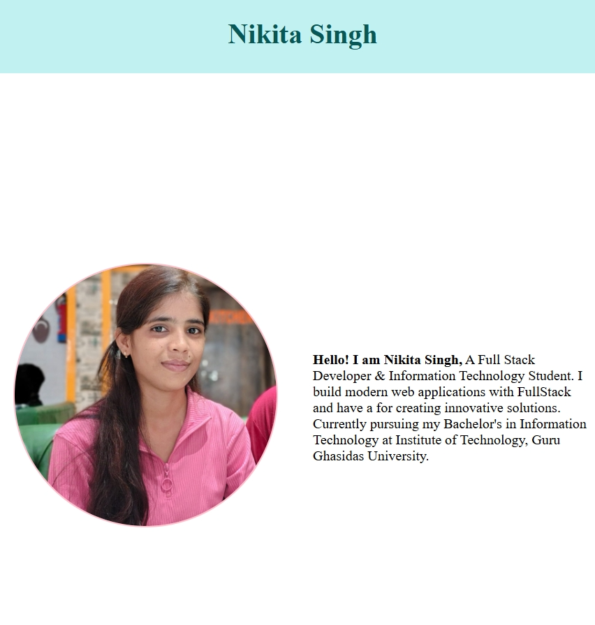
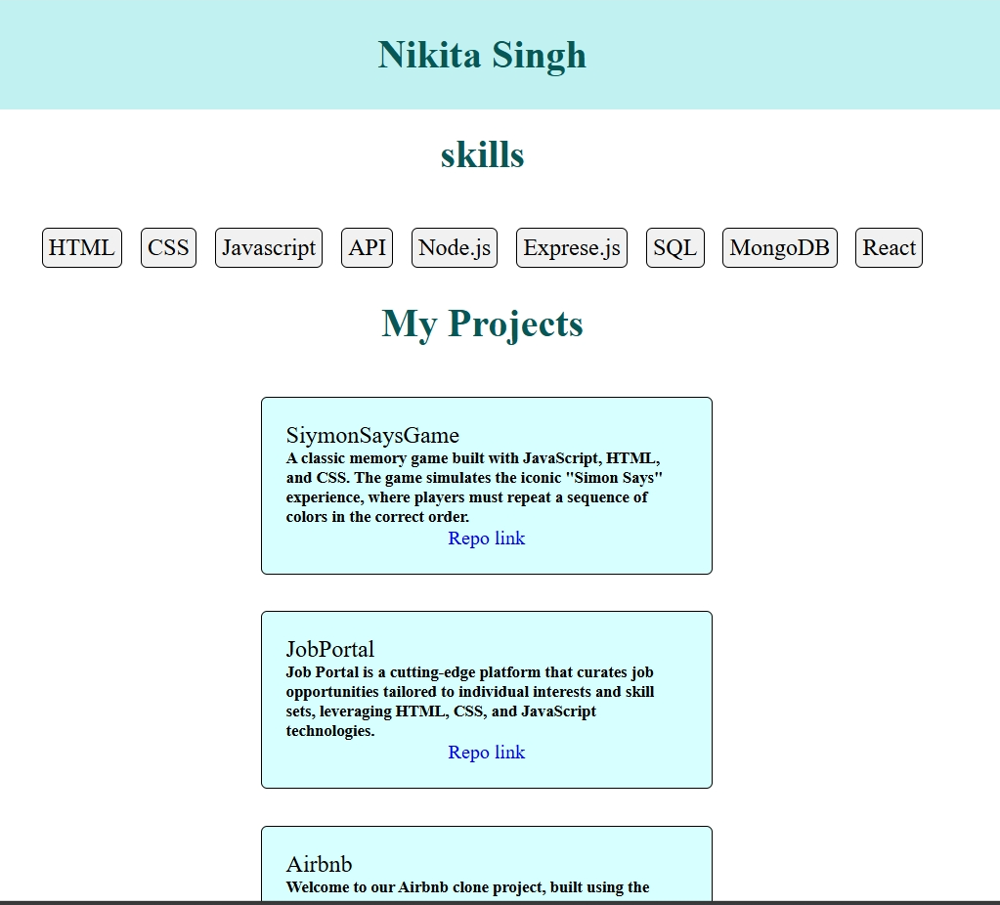

# Portfolio Page

## Overview
This is my portfolio page, showcasing my skills and projects. It is a simple yet elegant design that highlights my work and experience.

## Screenshots

## Technologies Used
* HTML
* CSS
* JavaScript

## Features
* Responsive design
* Interactive elements
* Project showcase

## Live Demo
You can view the live demo of my portfolio page [here](https://nikita-singh-14.github.io/portfolio-page/).

## Installation
To run this project locally, follow these steps:

1. Clone the repository: `git clone https://github.com/Nikita-singh-14/portfolio-page.git`
2. Navigate to the project directory: `cd portfolio-page`
3. Open the `index.html` file in your browser.

## Contact
If you have any questions or feedback, feel free to reach out to me:

* Email: [nikitasingh@email.com](mailto:nikitasingh@email.com)
* LinkedIn: [linkedin.com/in/nikitasingh](https://www.linkedin.com/in/nikitasingh/)

