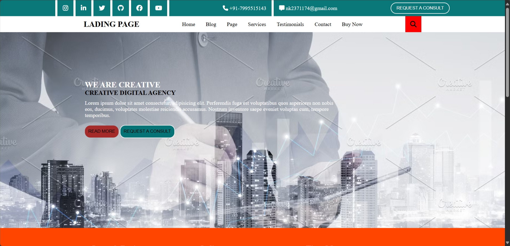
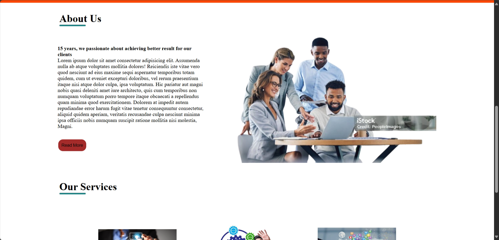

Overview
This is a landing page project, created as part of the Codsoft internship program. The page is designed to showcase a product or service in a visually appealing way.

## Screenshots

## Technologies Used
* HTML
* CSS

## Features
* Responsive design
* Clean and modern layout
* Call-to-action buttons

## Live Demo
You can view the live demo of my landing page [here](https://nikita-singh-14.github.io/CODSOFT/).

## Installation
To run this project locally, follow these steps:

1. Clone the repository: `git clone https://github.com/Nikita-singh-14/CODSOFT.git`
2. Navigate to the project directory: `cd CODSOFT/TASK-2`
3. Open the `index.html` file in your browser.

## Contact
If you have any questions or feedback, feel free to reach out to me:

* Email: [nk2371174@gmail.com](mailto:nikitasingh@email.com)
* LinkedIn: [linkedin.com/in/nikitasingh](https://www.linkedin.com/in/nikita-singh-3560652bb?utm_source=share&utm_campaign=share_via&utm_content=profile&utm_medium=android_app)

